<p align="center">
  <picture>
    <source media="(prefers-color-scheme: dark)" srcset="docs/img/header_dark.png">
    
  </picture>
</p>

<h3 align="center">
Browse and interact with Codex more easily, and connect Codex with your terminal and workflow in one place.
</h3>

[](https://www.npmjs.com/package/codex-deck)
[](https://opensource.org/licenses/MIT)

<div align="center">
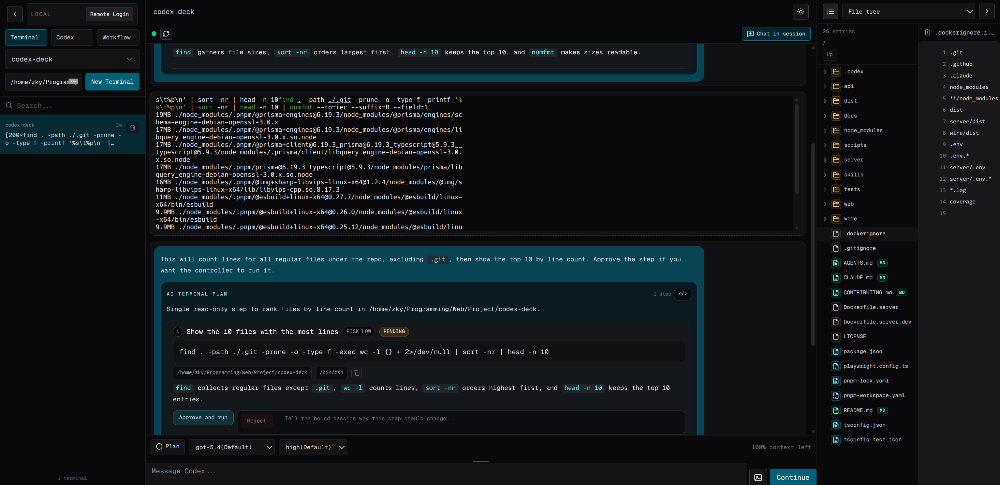
</div>
<h4 align="center">
AI Terminal brings Codex's AI capabilities to your terminal.
</h4>

<div align="center">
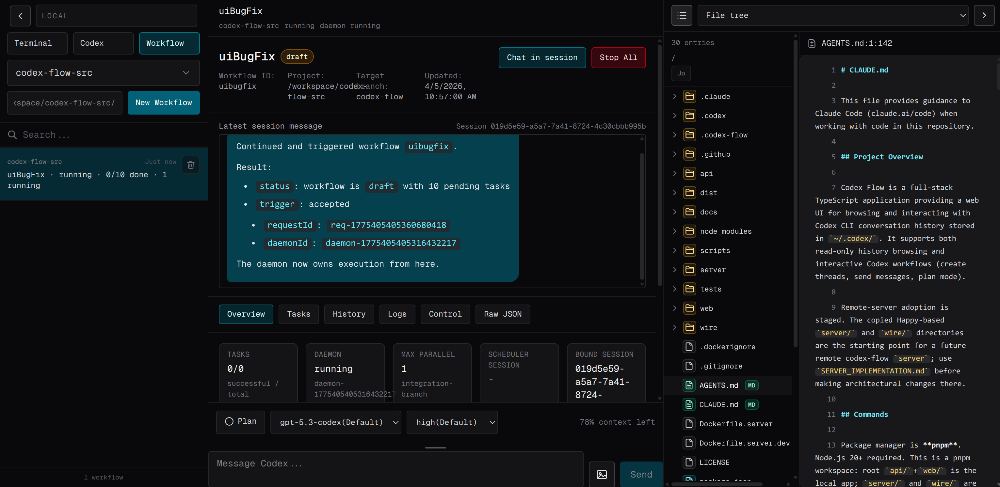
</div>
<h4 align="center">
AI Workflow lets you queue tasks, keep Codex working 24/7, and add new tasks at any time.
</h4>

## Features

Codex capabilities:

- **Session controls** - Stop generation, rename thread, fork thread, compact context, switch agent threads, and delete sessions.
- **In-browser messaging** - View and send messages across codex-deck instances with real-time updates.
- **Image attachments** - Attach images by drag/drop, paste, file picker, or mobile camera/gallery.
- **Model and reasoning controls** - Pick a model and reasoning effort per session and before sending.
- **Plan actions** - Use Plan mode and apply plan proposals.
- **`/`, `@`, and `$` support** - Use slash commands, file mentions, and skill mentions in the composer (similar to Codex CLI).
- **Live session list** - Real-time session updates with project filtering and session search.
- **Environment variables** - Pass environment variables into codex sessions.

Remote mode:

- **Local + remote connection modes** - Browse local `~/.codex` history or connect to a remote codex-deck server.
- **Local + remote updates together** - Pages stay in sync in both local and remote modes, with smooth switching between modes.
- **Network stability** - Provides a flexible experience in poor network conditions in remote mode.
- **Secure remote auth** - OPAQUE-based login flow with trust pins, saved browser auth restore, and machine selection.

UI design:

- **Mobile-friendly interface** - The UI is designed to adapt to mobile phone browsers.
- **Block mode** - View full, detailed message content in blocks.
- **Text mode** - Simplify less important message blocks into readable text lines.
- **Expandable blocks** - Toggle blocks between compact and expanded views, with clean copy behavior.

Code context and inspection:

- **Right pane diffs** - View `unstaged`, `staged`, or `last-turn` file diffs with patch rendering.
- **File tree + search + preview** - Browse the session file tree, search files, and open file content with code, image, and PDF previews.
- **Session skills pane** - Inspect and toggle skill enablement for the selected session.

AI-monitored task workflow:

- **Simple yet powerful task workflow scheduler** - Git-worktree-based workflows let users create workflows, adjust tasks, check status, and merge back into branches using natural language.
- **Workflow automation pane** - Create workflows with AI, bind sessions, launch tasks, view history/logs/raw JSON, send control messages, and manage daemon start/stop.
- **Tabbed workflow views** - Navigate workflow status and actions through `Overview`, `Tasks`, `History`, `Logs`, `Control`, and `Raw JSON`.
- **Bind tasks and Codex sessions** - Each agent/task in a workflow is tied to a Codex session.
- **Agent rules in workflow** - Persistent rules for agent tasks are supported in workflows.

Terminal:

- **Terminal workspace** - Create and manage multiple live terminals with shared read and ownership-based write control.
- **Background terminal runs** - Inspect per-session terminal run history/output with real-time updates.

### Feature previews:

- Terminal & Workflow & Codex
<div align="center">
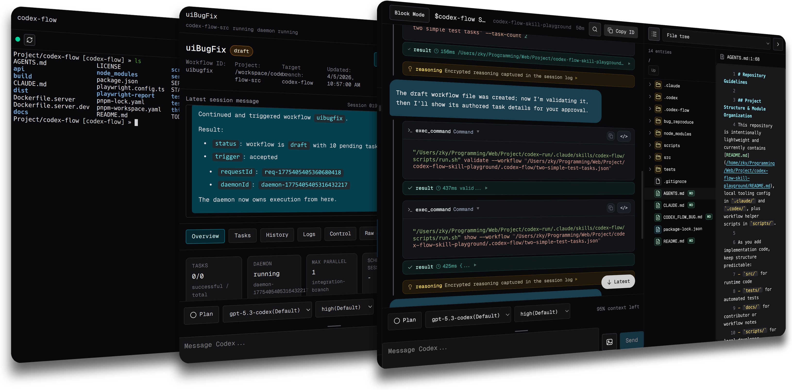
</div>

- Block mode vs Text mode

  <div align="center">
  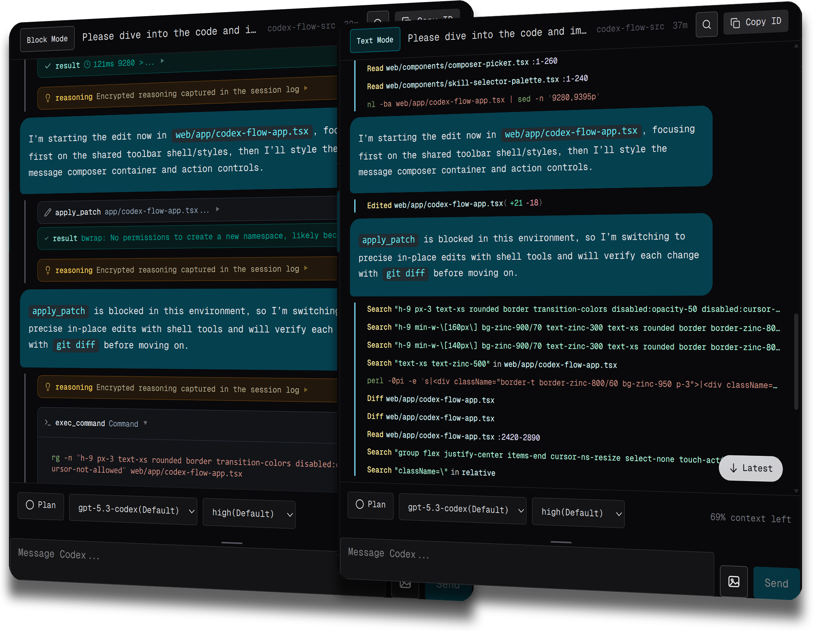
  </div>

- Right panes

  <div align="center">
  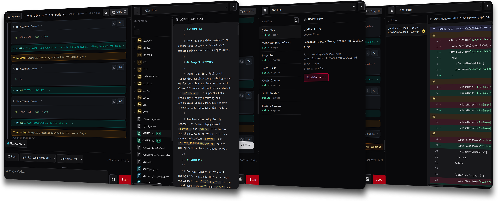
  </div>

- Mobile phone page

  <div align="center">
  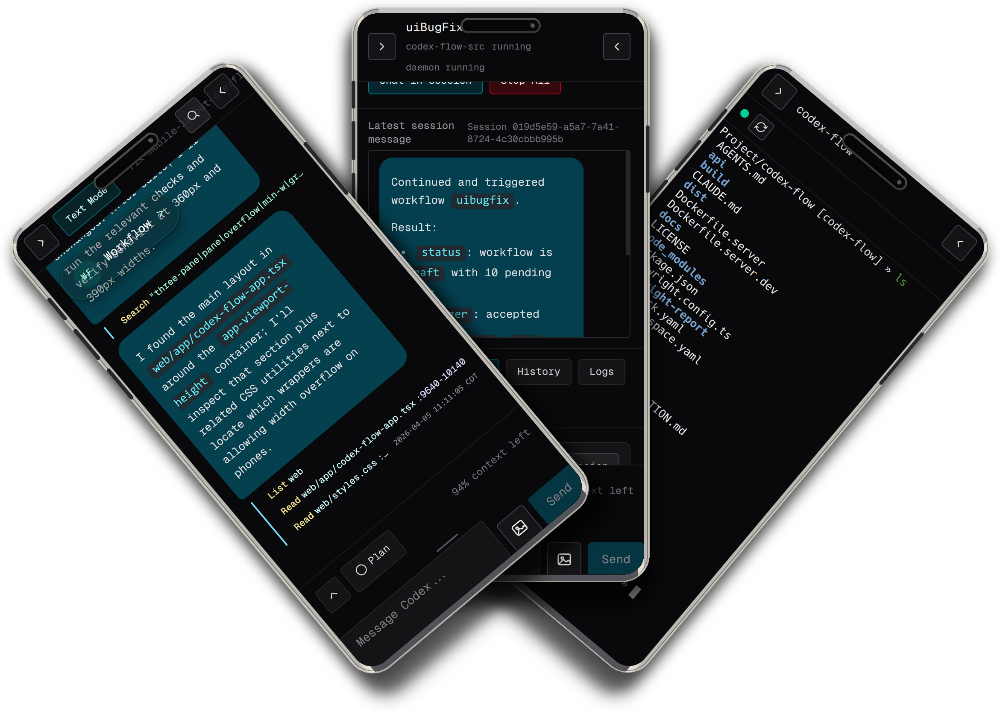
  </div>

- Images support

  <div align="center">
  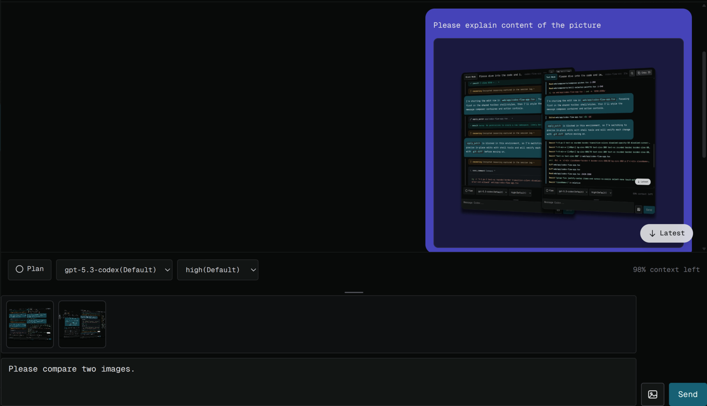
  </div>

- `/`, `@`, and `$` support in the message input box

  <div align="center">
  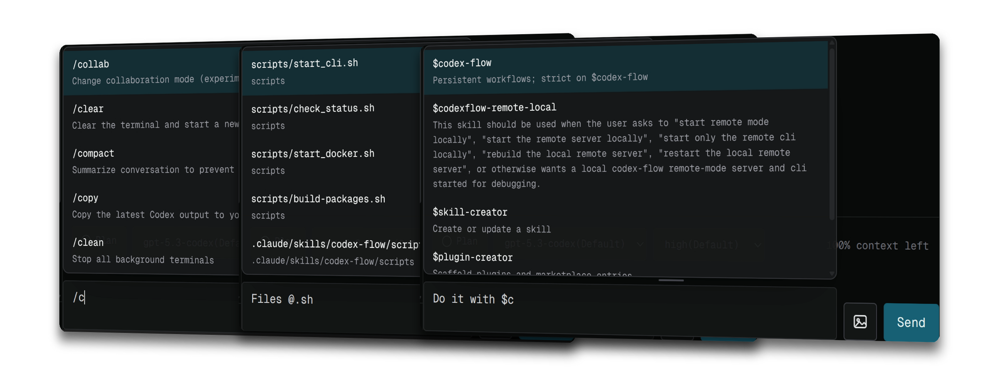
  </div>

- Supported message block views
  - Expanded blocks

    <div align="center">
    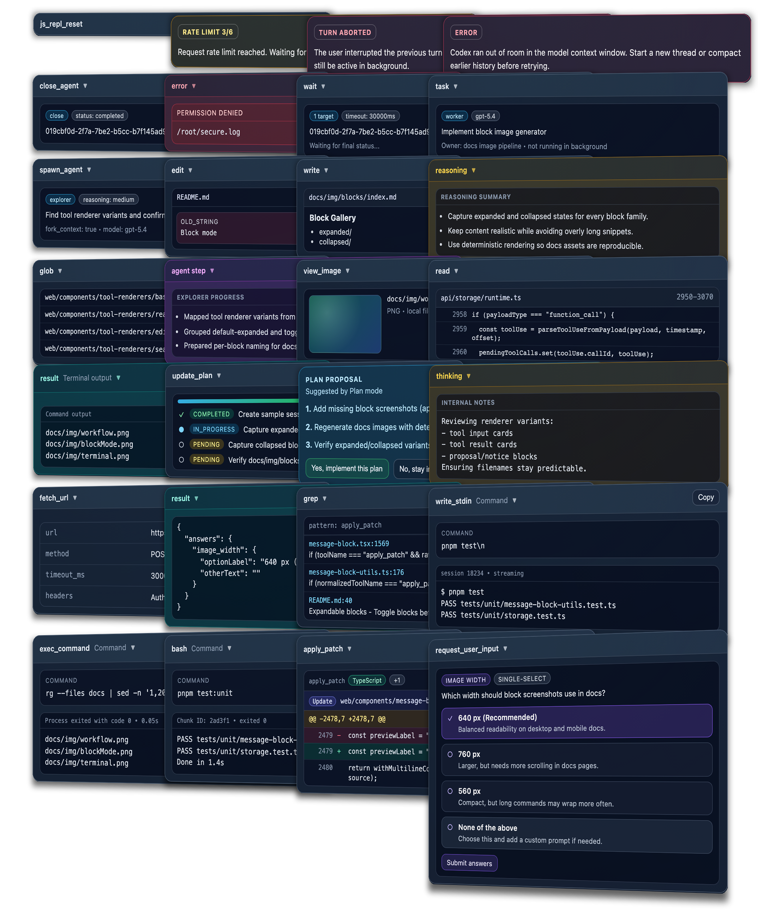
    </div>

  - Collapsed blocks

    <div align="center">
    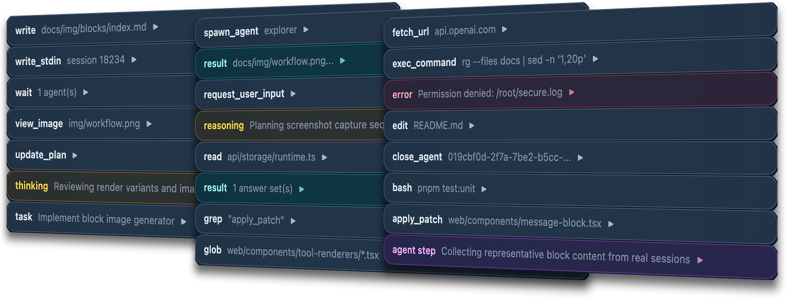
    </div>

## Requirements

- macOS, Linux, or WSL (Windows Subsystem for Linux)
- Node.js 20+
- Codex CLI installed and initialized at least once

Interactive mode uses `codex` under the hood. If `codex` is not on your `PATH`, set:

```bash
export CODEX_CLI_PATH="/absolute/path/to/codex"
```

## Installation (Local mode)

### Option 1: Install globally from npm

```bash
npm install -g codex-deck
```

Run from any directory:

```bash
codex-deck
```

By default, Codex Deck opens `http://localhost:12001` in your browser.

Uninstall:

```bash
npm uninstall -g codex-deck
```

### Option 2: Run from source

```bash
git clone https://github.com/asfsdsf/codex-deck.git
cd codex-deck
npm install -g pnpm
pnpm install
pnpm build
pnpm start
```

Uninstall:

```bash
cd ..
rm -rf codex-deck
```

### Option 3: Use a release package

Download `codex-deck-vX.X.X-[arch]` from the [GitHub Releases page](https://github.com/asfsdsf/codex-deck/releases), extract it, and run the `codex-deck` executable from that directory.

Uninstall:

```bash
rm -rf codex-deck-vX.X.X-[arch]
```

No matter which local installation method you use, `codex-deck` supports these options:

```text
codex-deck [options]

Options:
  -V, --version        Show version number
  -p, --port <number>  Port to listen on (default: 12001)
  -d, --dir <path>     Codex directory path (default: ~/.codex)
  --dev                Enable CORS for development (frontend at localhost:12000)
  --no-open            Do not open browser automatically
  -h, --help           Show help
```

## Installation (Remote mode)

Quick map:

- `Server machine` (Docker host): runs remote `server` and hosts the web app.
- `Local machine` (where Codex runs): starts `codex-deck` CLI and connects to server.
- `Web page` (browser): signs in and controls connected local machines.

Security note:

- Synced Codex payloads are encrypted between `local machine` and `web page`; the `server` stores encrypted blobs plus routing metadata.
- If you open the web app directly from the server URL, that server controls the JavaScript sent to your browser. So only use the server-hosted web URL when you trust that server/operator.
- Use `https://` in real deployments. Use `http://` only for trusted local/lab testing.

### 1. Server machine: build and run

Clone the repository and enter the project root on the server machine:

```bash
git clone https://github.com/asfsdsf/codex-deck.git
cd codex-deck
```

Build the remote server image:

```bash
docker build -t codexdeck-server -f Dockerfile.server .
```

Server environment variables (used in this step):

- `CODEXDECK_REMOTE_ADMIN_PASSWORD` (required): password for `https://your-server-host/admin`.
- `CODEXDECK_REMOTE_SETUP_TOKENS` (optional): comma- or newline-separated setup tokens to seed on first boot. You can also create tokens later in the admin page.
- `PUBLIC_URL` (recommended): the public URL users and CLIs use to reach this server (use `https://...` in production).
- `CODEXDECK_REMOTE_BROWSER_AUTH_PERSISTENCE` (optional): browser login persistence. `session` ends on browser close, `remember` persists.

Run the server:

```bash
docker run -p 3005:3005 \
  -e CODEXDECK_REMOTE_ADMIN_PASSWORD=<admin-password> \
  -e CODEXDECK_REMOTE_BROWSER_AUTH_PERSISTENCE=remember \
  -e PUBLIC_URL=https://your-server-host \
  -v codexdeck-data:/data \
  codexdeck-server
```

This container serves both the remote web app and remote server. Data is stored in `codexdeck-data`.

### 2. Web page: create setup tokens

In a browser, open `https://your-server-host/admin`, log in with `CODEXDECK_REMOTE_ADMIN_PASSWORD`, and create one setup token for each local CLI you want to connect. If you prefer, you can still pre-seed tokens with `CODEXDECK_REMOTE_SETUP_TOKENS` before first boot.

### 3. Local machine: connect each Codex machine

On each local machine (the machine that has Codex CLI history), start `codex-deck` like this:

```bash
codex-deck \
  --remote-server-url https://your-server-host \
  --remote-setup-token <token-a> \
  --remote-username <cli-login-name> \
  --remote-password <cli-login-password>
```

### 4. Web page: sign in

Open `https://your-server-host/` in a browser and sign in with the same remote username and password used for that local machine.

## AI Terminal usage

You can chat with Codex at any time while working in the terminal.

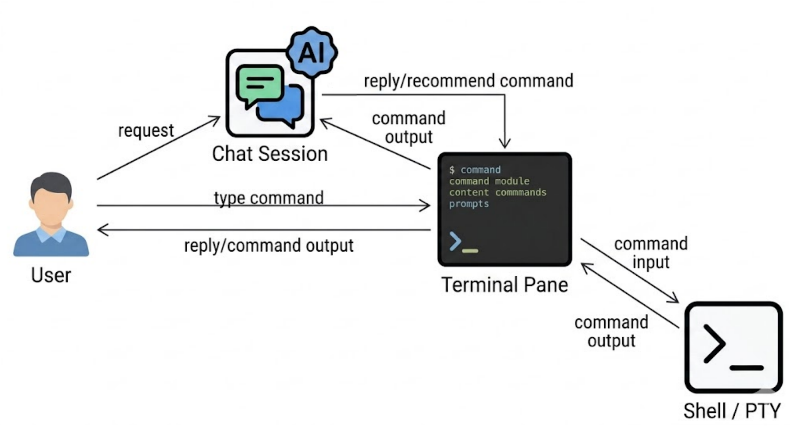

To use AI Terminal:

1. Click `Terminal` in the left pane.
2. Click `New Terminal`.
3. Alternate between typing shell commands and chatting with the Codex session.

You can also:

- Click `Chat in session` to see the detailed steps in the Codex session.
- Click `Continue` to let the Codex session continue.

## Workflow usage

Using workflows is as easy as chatting.

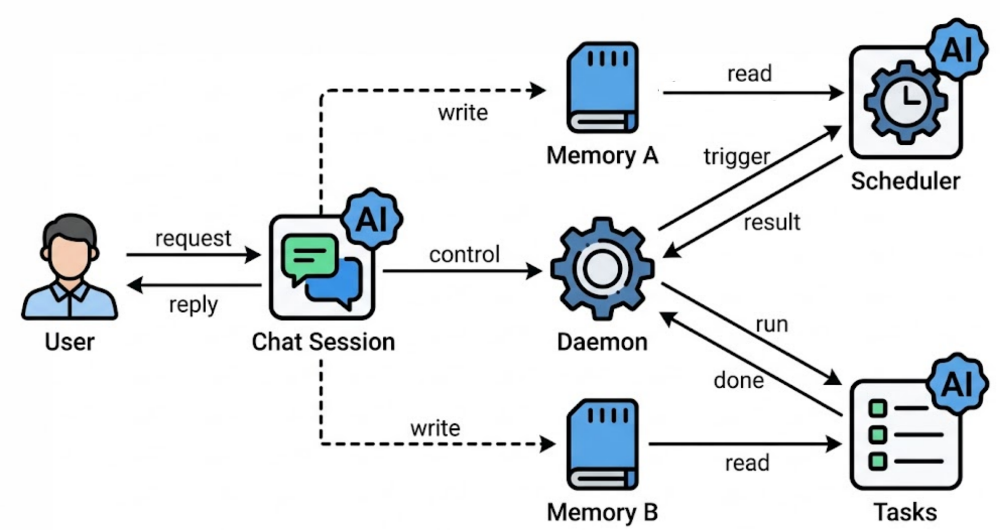

To create a new workflow:

1. Click `Workflow` in the left pane.
2. Click `New Workflow`.
3. Describe what you want in the chat.

Example chat requests (user side only):

- **Ask questions**: "How do I use the codex-deck-flow workflow system?"
- **Create tasks**: "Create a workflow to add GitHub OAuth login with backend API updates, frontend UI changes, and tests."
- **Create tasks**: "Create 10 tasks. Each task should dive into the project, find a frontend UI bug, and fix the code until all unit tests pass."
- **Add tasks**: "Add a task to make a better improvement based on the previous task."
- **Merge git worklist**: "Merge the tasks."
- **Show task status**: "Summarize task running status."
- **Add memory to agents**: "Fix the code until all unit tests pass for all tasks in all workflows."
- **Diagnose workflow**: "Workflow fails to run. Please fix it."

> **Notes:** `sandbox_mode = "danger-full-access"` is enabled for workflow agents.

Requirements:

- Run inside a Git repository.
- Skill codex-deck-flow is installed.

## Development

```bash
git clone https://github.com/asfsdsf/codex-deck.git
cd codex-deck
pnpm install
pnpm build
pnpm dev
```

`pnpm dev` starts:

- frontend at `http://localhost:12000`
- backend at `http://localhost:12001`

## Build portable packages

```bash
pnpm build:packages
```

This builds portable archives in `./build/` for:

- `macos-arm64`
- `macos-x64`
- `linux-x64`

On non-Linux hosts, `linux-x64` packaging requires Docker because `node-pty` must be installed on Linux.

Limit targets with:

```bash
./scripts/build-packages.sh --targets macos-arm64,macos-x64
```

## Acknowledgements

- Server design inspiration: [slopus/happy](https://github.com/slopus/happy)
- Web theme inspiration: [kamranahmedse/claude-run](https://github.com/kamranahmedse/claude-run)

## License

MIT © zzami
